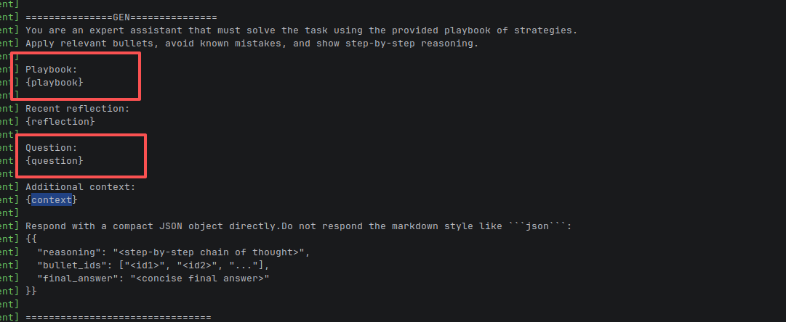

# 11.20 TODO
初步完善一下Generator。

具体方法：在后端的[MyWorkflow.py](agent/agent/MyWorkflow.py)里面，先拼接下prompt的Playbook和Question部分。
Playbook到时候我给你个Qdrant的库，你用llamaindex或者是原生的API都可以，暂时把全部的索引条目全拿过来，填充在里面，
question里面填充的就是用户的输入。

